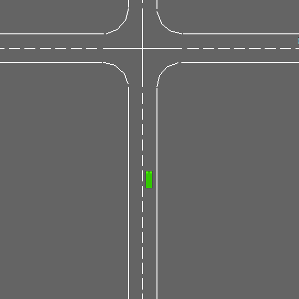

# Decision-Making Under Uncertainty: Highway Intersection Use Case

This project is a comparative study of decision-making algorithms for multi-agent coordination, using a highway intersection crossing as a use case. It starts with a rule-based control (baseline), then Deep Q-Learning (both agents learn simultaneously, each treating the other as part of a changing environment), and Cooperative Multi-Agent RL (shared rewards and penalties across agents).

<!-- TODO: what this project demonstrates and why the three-phase progression matters (this is your "so what" for a reviewer)-->

### Study materials

- [*Algorithms for Decision Making*](https://algorithmsbook.com/decisionmaking/) by Mykel J. Kochenderfer, Tim A. Wheeler, Kyle H. Wray 
- Stanford's AA228/CS238 DecisionMaking Under Uncertainty, [Course Materials](https://drive.google.com/drive/u/0/folders/1Fs7ad1-YTjVtFocmihgkoja25rSOup0Z) 

## Environment

- **Simulator:** [highway-env](https://highway-env.farama.org/)  (`intersection-multi-agent-v2`)
- **Agents:** 2 controlled vehicles, cooperative/general-sum intersection crossing <!-- **Action space:** `Discrete(3)` per agent — `0=SLOWER, 1=IDLE, 2=FASTER` || **Observation:** Kinematics, 15 nearby vehicles × 7 features, per-agent egocentric-->
- **Shared config:** [`env_config.py`](./env_config.py)

<!-- TODO: one line on why normalize_obs differs between Phase 1 (raw meters,
     for interpretable rule thresholds) and Phases 2-3 (normalized, standard
     for NN training) — physics/reward/action space stay identical, only
     observation preprocessing differs -->

## Phase 1: Rule-based Control

Simple rule-based logic of reactive agents. The approach is **proximity heuristic**: brake within `JUNCTION_RADIUS=20m` of center if another vehicle is within `CONFLICT_DISTANCE=10m`


**Results (30 episodes):**

| Metric | Value |
|---|---|
| Collision rate | 33.3% |
| Arrival rate (per agent) | 46.7% |
| Timeout rate (per agent) | 36.7% |
| Avg. time-to-cross | 10.75s |



## Phase 2: Deep Q-Learning (Single-agent RL)

*In Progress...*

## Phase 3: Cooperative Learning (Shared Parameter Network)

*In Progress...*

## Cross-Phase Comparison

| Phase | Collision Rate | Arrival Rate | Timeout Rate | Avg. Time-to-Cross |
|---|---|---|---|---|
| 1. Rule-based | 33.3% | 46.7% | 36.7% | 10.75s |
| 2. Independent Deep Q-Learning | TBD | TBD | TBD | TBD |
| 3. Cooperative MARL | TBD | TBD | TBD | TBD |

<!-- TODO: 2-3 sentence takeaway once all three rows are filled — what
     changed and why, tied back to the book concepts above -->

## Repo Structure

```
intersection-marl/
├── README.md
├── env_config.py
├── phase1_rule_based.py
├── phase2_independent_rl.py
├── phase3_marl_joint.py
├── output/
└── utils/
    ├── replay_buffer.py
    ├── gif_recorder.py
    └── metrics.py
```

## Running It

```bash
python phase1_rule_based.py  
python phase2_independent_rl.py
python phase3_marl_joint.py
```