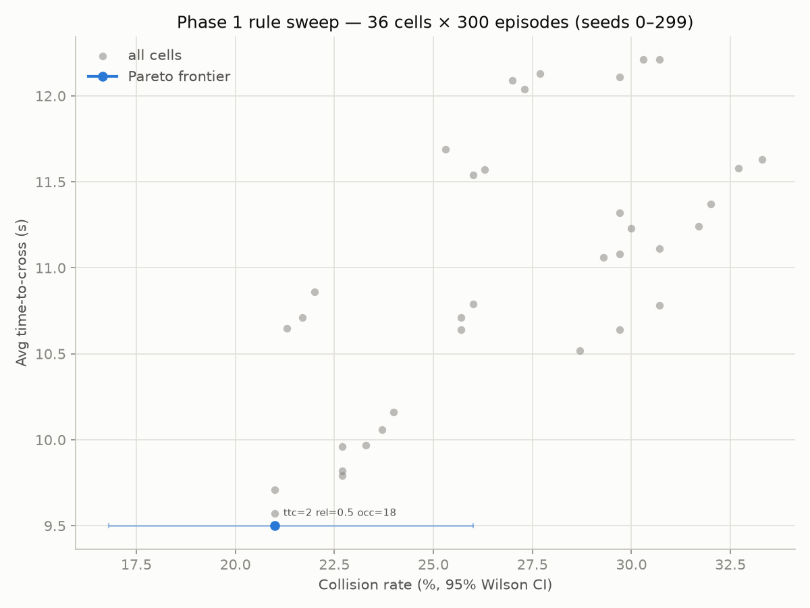
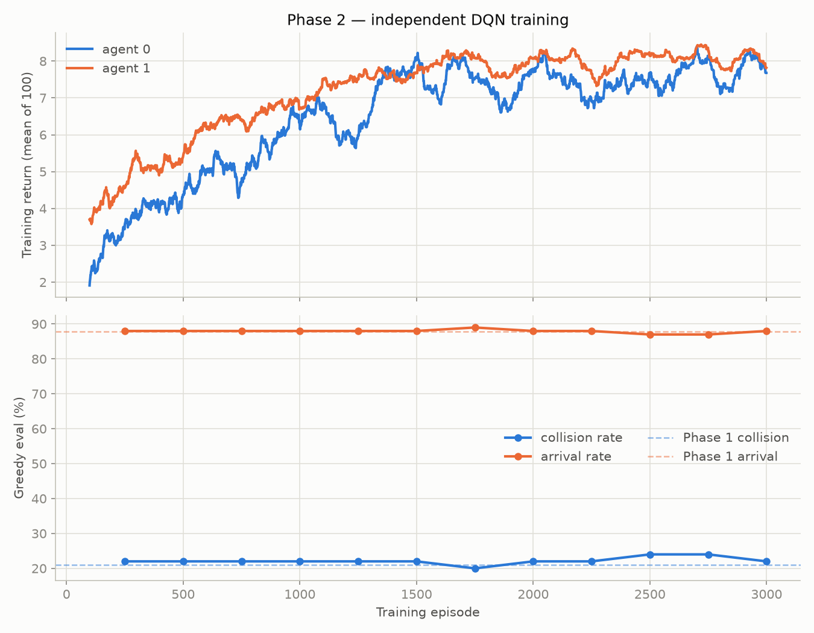

# Decision-Making Under Uncertainty: Highway Intersection Use Case

This project is a comparative study of decision-making algorithms for multi-agent coordination, using a highway intersection crossing as a use case. It starts with a rule-based control (baseline), then Deep Q-Learning (both agents learn simultaneously, each treating the other as part of a changing environment), and Cooperative Multi-Agent RL (shared rewards and penalties across agents).

### Study materials

- [*Algorithms for Decision Making*](https://algorithmsbook.com/decisionmaking/) by Mykel J. Kochenderfer, Tim A. Wheeler, Kyle H. Wray 
- Stanford's AA228/CS238 DecisionMaking Under Uncertainty, [Course Materials](https://drive.google.com/drive/u/0/folders/1Fs7ad1-YTjVtFocmihgkoja25rSOup0Z) 


## Environment

- **Simulator:** [highway-env](https://highway-env.farama.org/)  (`intersection-multi-agent-v2`)
- **Agents:** 2 controlled vehicles, cooperative/general-sum intersection crossing <!-- **Action space:** `Discrete(3)` per agent — `0=SLOWER, 1=IDLE, 2=FASTER` || **Observation:** Kinematics, 15 nearby vehicles × 7 features in absolute world coordinates (junction at the origin), 105 values per agent when flattened. `see_behind` is off, so an agent's rows can omit a vehicle behind it — including the other controlled agent.-->
- **Shared config:** [`env_config.py`](./env_config.py)


## Phase 1: Rule-based Control

Rule-based logic with reactive agents, built from four interacting rules:

- **Time-to-conflict braking.** Each vehicle's closing rate and closest point of approach are computed from relative position *and* velocity, so only vehicles actually on a collision course trigger a brake. The brake engages below `conflict_ttc` (2s) and releases only above `conflict_ttc + release_margin`.
- **Right-of-way by arrival order.** The agent that reaches the junction zone first goes; ties fall back to agent index.
- **Gap acceptance.** An agent enters only when the junction box is free of vehicles that are in it or will reach it within `conflict_ttc`
- **Box discipline.** Once committed inside the junction, the agent accelerates out rather than stopping to wait.


**Results (300 episodes):**

| Metric | Value |
|---|---|
| Collision rate | 21.0% |
| Arrival rate (per agent) | 87.8% |
| Timeout rate (per agent) | 0.7% |
| Avg. time-to-cross | 9.50s |


### Threshold sweep



**The frontier is a single point,** because the two objectives turn out not to be in tension: the safest setting is also the fastest

## Phase 2: Independent Deep Q-Learning

Each agent trains its own Q-network on its own observation, with no shared weights and no communication. From either agent's point of view the other is simply part of the environment. 

Both networks are the same small MLP: 105 inputs (15 vehicles × 7 features, flattened). Observations are normalized to `[-1, 1]`.

| Hyperparameter | Value | |
|---|---|---|
| Episodes | 3000 | ~36k environment steps |
| Discount γ | 0.95 | 1/(1−γ) = 20 steps, same as the episode length |
| Learning rate | 5e-4 | Adam |
| Batch / buffer | 64 / 10,000 | Buffer deliberately small  |
| Target sync | every 500 steps | hard copy |
| Exploration ε | 1.0 → 0.05 | linear over the first half of training |

The replay buffer is kept small on purpose. Under independent learning the *other* agent's policy keeps changing, so old transitions describe an opponent that no longer exists; a buffer holding roughly a third of the run forgets them at about the right rate.

**Results (300 episodes, 95% Wilson intervals):**

| Metric | Value |
|---|---|
| Collision rate | 19.7% [15.6, 24.5] |
| Arrival rate (per agent) | 89.2% [86.4, 91.4] |
| Timeout rate (per agent) | 0.5% [0.2, 1.5] |
| Avg. time-to-cross | 9.07s |

Held out on 300 unseen episodes (seeds 1000–1299): collision 20.0% [15.9, 24.9], arrival 89.7%, 8.95s to cross. The policy generalizes.



Training return climbs steadily: agent 0 from 1.9 to about 7.8, agent 1 from 3.6 to about 8.0. But that curve is confounded by the exploration schedule. Return is collected *with* ε-greedy noise still on, so most of the rise reflects ε decaying rather than the policy improving. The greedy evaluation underneath, measured at ε=0 throughout, reads 22.0% at episode 250 and 22.0% at episode 3000: the policy reached its final quality within the first few hundred episodes and then did not improve for the remaining 2,750.

## Phase 3: Cooperative Learning (Shared Parameter Network)

*In Progress...*

## Cross-Phase Comparison

All rows are 300 episodes on the same seeds (0–299), scored by the same evaluator, with 95% Wilson intervals on the collision rate.

| Phase | Collision Rate | Arrival Rate | Timeout Rate | Avg. Time-to-Cross |
|---|---|---|---|---|
| 1. Rule-based | 21.0% [16.8, 26.0] | 87.8% | 0.7% | 9.50s |
| 2. Independent DQN | 19.7% [15.6, 24.5] | 89.2% | 0.5% | 9.07s |
| 3. Cooperative MARL | TBD | TBD | TBD | TBD |


<!-- TODO: 2-3 sentence takeaway once all three rows are filled — what
     changed and why, tied back to the book concepts above -->

## Repo Structure

```
intersection-marl/
├── README.md
├── env_config.py
├── phase1_rule_based.py
├── phase1_sweep.py
├── phase2_independent_rl.py
├── phase3_marl_joint.py
├── output/
└── utils/
    ├── q_network.py
    ├── replay_buffer.py
    ├── gif_recorder.py
    └── metrics.py
```

## Running It

```bash
python phase1_rule_based.py       # evaluation + sample-episode GIF
python phase1_sweep.py            # threshold sweep, frontier CSVs + plot (~17 min)
python phase2_independent_rl.py   # train two independent DQNs (~1 hour)
python phase3_marl_joint.py
```